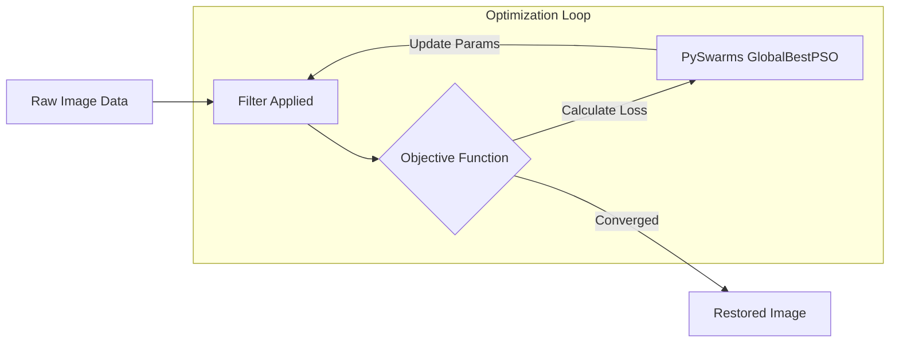

<div align="center">

# Optimization Methods in Damage Detection
**A Particle Swarm Optimization (PSO) driven framework for automated image denoising and damage evaluation.**

[](https://www.python.org/downloads/)
[](https://opencv.org/)
[](https://scikit-image.org/)
[](https://opensource.org/licenses/MIT)

</div>

## 📌 Overview

Filtering noise and detecting damage in images are foundational challenges in computer vision. Traditionally, finding the optimal parameters for specialized filters (like Gaussian or Bilateral) involves brute-force grid searches across multiple metrics like PSNR (Peak Signal-to-Noise Ratio) or SSIM (Structural Similarity Index).

This project replaces brute-force search and avoids heavy Deep Learning (CNN) overhead by implementing **Particle Swarm Optimization (PSO)**. 

The optimizer acts as a swarm of agents seeking the absolute optimal hyperparameters for smoothing filters based explicitly on custom objective outcomes.

**Design Choice:** *I chose PSO because grid search on every possible parameter scales poorly. My goal was to strictly use traditional ML/Math optimization methods to understand the underlying parameter space rather than relying on deep learning black boxes.*

---

## 🏗️ Architecture & Pipeline



### The Filters Evaluated
- **Gaussian Blur**: Fast standard deviation-based smoothing.
- **Median Blur**: Non-linear filtering, highly effective against salt-and-pepper noise.
- **Bilateral Filter**: Advanced edge-preserving smoothing.

### The Objective Formulas
Instead of relying solely on standard PSNR or SSIM, this implementation evaluates results using **Edge-Aware variations**:
1. **Combined Metrics**: Sobel edge mapping is injected and combined with standard loss ranges.
2. **The Goal**: Push both PSNR and SSIM evaluation weights towards parity (around 1). This ensures the optimizer respects *both* noise reduction and structural line preservation equally, without washing out the image. 

---

## 📊 Results & Benchmarks

The benchmarking scripts log execution times across all filter/objective combinations on the **SIDD Benchmark** dataset.

.png)

### Key Observations:
- **SSIM > PSNR**: Optimizing for SSIM yielded visibly better structural coherence. PSNR optimization often caused the images to become too washed out and blurred, especially when using Gaussian filtering.
- **Filter Performance**: The **Bilateral filter** performed exceptionally well on images with clean, straight geometry and edges. However, it struggled to adapt to naturally softer, organic textures compared to Median filtering.
- **Execution Consistency**: While PSNR demonstrated lower median execution times during optimization, it produced sporadic outliers during runtime that negatively impacted swarm convergence.

*(For benchmark replication, see the execution scripts below).*

---

## 📂 Project Structure

```text
Optimization-methods-in-damage-detection-on-images/
├── data/
│   └── raw/                  # SIDD Dataset (Not tracked in Git)
├── resources/                # Result plots and GUI charts
├── src/                      # Reusable core modules
│   ├── core/                 # Noise generators & processing functions
│   ├── evaluation/           # Loss metrics (PSNR, SSIM, Edge-aware)
│   └── optimization/         # Filter pipelines & PSO implementations
├── scripts/                  # Standalone execution targets
│   ├── explore_noise_detection.py
│   ├── execution_time_benchmark.py
│   └── prepare_submission.py
├── tests/                    # Verification tests
│   └── test_psnr.py
├── .gitignore
├── requirements.txt
└── README.md
```

---

## 🚀 Getting Started

### 1. Requirements & Setup
This project uses standard scientific Python libraries (`numpy`, `scipy`, `opencv-python`, `pyswarms`).

```bash
# 1. Clone the repository
git clone https://github.com/Lionile/Optimization-methods-in-damage-detection-on-images.git
cd Optimization-methods-in-damage-detection-on-images

# 2. Setup your virtual environment
python -m venv env
source env/bin/activate      # Linux/macOS
# env\Scripts\activate       # Windows

# 3. Install core dependencies
pip install -r requirements.txt
```

### 2. Sourcing the Data
The benchmarking execution relies on the **[Smartphone Image Denoising Dataset (SIDD)](https://abdokamel.github.io/sidd/)**. 
Ensure `SIDD_Small_sRGB_Only` is unzipped and placed in the `data/raw/` directory before running the scripts.

### 3. Execution Commands
To run the full optimization pipeline and generate benchmark CSVs:

```bash
python scripts/execution_time_benchmark.py
```

To run exploratory clustering metrics (KMeans/DBScan testing):
```bash
python scripts/explore_noise_detection.py
```

To run standard standalone PSNR tests:
```bash
python tests/test_psnr.py
```